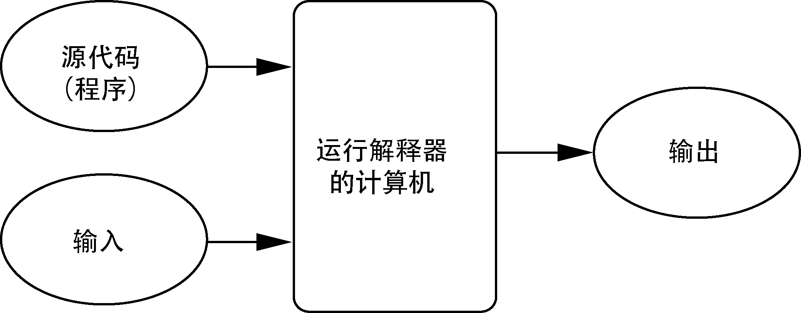

# 计算机语言的研究路线图

在这个系列的笔记中，我将记录下自己在研究计算机语言的过程中所积累的一些心得体会，笔记的内容将会包括我对编程语言、标记语言的了解，以及我学习各种语言的具体过程。希望这些笔记能够帮助到那些对编程语言感兴趣的朋友们。下面是这一系列研究的路线图规划以及相关的笔记索引。

## 关于编程语言

在理想情况下，我们当然会更希望能像许多科幻电影中那样，可以直接使用人类语言来向计算机传递操作指令。目前，计算机科学家们在这个方向上也的确取得了显着的进步，并开发出了一系列看似能理解人类语言的产品，例如Siri（苹果）、小艺（华为）等语音助手，以及ChatGPT（OpenAI）、文心一言（百度）这类更新一代的通用内容生成工具。然而，即使不考虑这些产品背后的数学真相，就算AI有一天真的能理解人类的语言，考虑到人类语言中天然存在的模糊性与不精确性，它本身也并不适合用于描述复杂的算法。例如，在“I saw the man in the park with the telescope”这一英文句子中，拿着望远镜的人是我，还是那个男人？在公园里的究竟是谁？人类之所以在大多数时候能够实现相互理解，是因为他们拥有着大量共同的知识和经验。但即便如此，人们之间的误解也依然时有发生。

为了解决上述问题，计算机科学家们专门设计了一系列能精确描述计算指令的符号系统，这些符号系统就是我们今天所知的*编程语言（Programming Languages）*。换而言之，编程语言就是一套计算机指令的编写规则，其中的每个组成单元都被定义了明确的含义（即语义）以及编写格式（即语法），正因为如此，我们所编写的程序通常被称为*计算机代码（Computer Code）*，而编写代码的过程则被称为*编码（Coding）*。

目前已被开发出来的编程语言不仅在数量上成千上万，它们本身也会随着时间迭代出多个版本，这些版本之间有时还会存在很大的差异。但是，无论这些语言在各自细节上存在着多少不同之处，但它们都有着定义明确、无歧义的语法和语义。当然，我们在这里所指的通常都是高级编程语言，这些语言的设计目的是方便人类的使用和理解，故而通常并不属于可被CPU直接执行的*机器语言（machine language）*。举例来说，如果我们希望向计算机传递一组能将两个整数相加的操作指令，使用人类语言可能会将其表述如下：

> 将内存中位置为`2001`的数加载到CPU中
> 将内存中位置为`2002`的数加载到CPU中
> 在CPU中将这两个数相加
> 将结果存放到位置为`2003`的地方

是不是觉得将两个整数相加的操作指令比您想象的要复杂一些？很遗憾，实际情况恐怕还会比这里复杂得多，因为在机器语言中，以上指令和数字还得要用二进制的方式来表示，也就是说，它们实际上应该是一组0和1的序列。相对的，如果到了抽象的高级编程语言中，将两个数相加的操作指令就只需自然地表述为`c = a + b`即可。

### 关于编译与解释

当然，尽管使用高级编程语言编写程序会让其代码显得更简单易懂一些，但这也意味着我们需要先将它“翻译”成机器语言，才能交由算机硬件去执行。目前，可将高级编程语言“翻译”成机器语言的方法主要有*编译（compiled）*和*解释（interpreted）*这两种。其中，用于执行编译任务的*编译器（Compiler）*是一个较为复杂的程序，其执行任务的过程如下图所示。在该过程中，高级程序被称为*源代码（source code）*，而其得到的*机器代码*就是可被计算机直接执行的程序，上图中的虚线表示就是机器代码的执行过程，这一过程也称为“运行程序”。

而用于执行解释任务的*解释器（Interpreter）*则本质上是一个虚拟程序，它的功能是虚拟一台能直接理解指定高级语言的计算机。换而言之，解释器不会将目标程序的源代码翻译成用机器语言表述的等效程序，它会直接逐条分析并执行该源代码中的指令，其过程如下图所示。

以上两者的主要区别在于：源代码的编译属于一次性的翻译，目标程序一旦完成了编译，它后续在计算机上无论被运行多少次，都不再需要编译器或源代码的参与了。但是，如果目标程序采用的是解释执行，那么它在计算机上的每次运行都需要有解释器和源代码的参与。也正因为如此，编译型语言通常能赋予程序更快的运行速度，因为它的翻译是一次完成的，而解释型语言则可以赋予人们更灵活的交互式编程体验，因为它的翻译是在程序每次运行过程中逐条进行的。

另外，我们从这里也可以看到高级语言相对于机器语言的另一个优点：*可移植性（portability）*。一台计算机的机器语言通常是由其CPU的设计者创建的，因此每种类型的计算机都有属于的机器语言。这样一来，我们在笔记本中针对Intel i7处理器编写的程序，通常是无法直接运行在一台装有ARMv8处理器的智能手机上的。而在另一方面，只要拥有了合适的编译器或解释器（它们只不过是另一程序），使用高级语言编写的程序则是可以运行在各种不同类型的计算机上的。例如，我们完全可以在自己的笔记本和平板电脑上运行一模一样的Python程序，因为尽管这两台计算机中装载是不同的CPU，但他们都装配了可用于执行该程序的Python解释器。

### 学习笔记索引

- [[JavaScript 语言的学习路线图|JavaScript 学习笔记]]
- [[Python 语言的学习路线图|Python 学习笔记]]
- [[Rust 语言的学习路线图|Rust 学习笔记]]

## 关于标记语言

<!-- 以下内容尚待整理 -->

标记语言（Markup Language）是一种将文本（Text）以及文本相关的其他信息结合起来，展现出关于该网页结构和数据的计算机文字编码。与文本相关的其他信息（包括例如文本的结构和连结等）与原来的文本结合在一起，但是使用标记（markup）进行标志。当今广泛使用的置标语言是超文本置标语言（HyperText Markup Language，HTML）和可扩展置标语言（eXtensible Markup Language，XML）。置标语言广泛应用于网页和网络应用程序。标记最早用于出版业，是作者、编辑以及出版商之间用于描述出版作品的排版格式所使用的。

### 语言的分类

标志语言通常可以分为三类：表示性的、过程性的以及描述性的。

- 表示性的标志语言：表示性的标志语言（Presentational markup）是在编码过程中，标记文档的结构信息。例如，在文本文件中，文件的标题可能需要用特定的格式表示（居中，放大等），这样我们就需要标记文件的标题。字处理以及桌面出版产品有时候能够自动推断出这类的结构信息，但是绝大多数的，像Wiki这样的纯文本编辑器还不能解决这个问题。

- 过程性标志：过程性标志语言（Procedural markup）一般都专门于文字的表达，但通常对于文本编辑者可见，并且能够被软件依其出现顺序依次解读。为了格式化一个标题，在标题文本之前，会紧接着插入一系列的格式标志符，以指示计算机转换到居中的显示模式，同时加大及加粗字体。在标题文本之后，会紧接缀上格式中止标志；对于更高级的系统宏命令或者堆栈模式会让这一过程的实现方式更加丰富。大多数情况下，过程性标志能力包含有一个Turing-complete编程语言。过程性标志语言的范例有：nroff, troff, TeX, Lout以及PostScript。过程性标志语言被广泛应用在专业出版领域，专业的出版商会根据要求使用不同的指标语言以达到出版要求。

- 描述性标志：描述性标志（Descriptive Markup）也称通用标志，所描述的是文件的内容或结构，而不是文件的显示外观或样式，制定SGML的基本思想就是把文档的内容与样式分开，XML、SGML都是典型的通用标志语言。

历史
“标志（markup）”这个词来源自传统出版业的“标记”一个手稿，也就是在原稿的边缘加注一些符号来指示打印上的要求。长久以来，这个工作都是由专门的人（"markup men"）以及校对人来进行，对原稿标志出使用什么样的字体，字型以及字号，然后再将原稿交给其它人进行手工的排版工作。

GenCode
[icon]	
此章节尚无任何内容，需要扩充。
TeX
TeX是一个由美国电脑教授高德纳（Donald E. Knuth）编写的功能强大的排版软件。它在学术界十分流行，特别是数学、物理学和计算机科学界。TeX被普遍认为是一个很好的排版工具，特别是在处理复杂的数学公式时。利用诸如是LaTeX等终端软件，TeX就能够排版出精美的文本。

SGML
SGML是一种专门的标记语言，被用作编写《牛津英语词典》的电子版本。由于SGML的复杂，导致难以普及。

HTML
主条目：HTML
超文件标志语言（英文：HyperText Markup Language，简称为HTML）是为网页创建和其它可在网页浏览器中看到的信息设计的一种标志语言。

XML
主条目：XML
可扩展标志语言（eXtensible Markup Language，简称XML），又称可扩展标记语言，是一种标志语言。标志指计算机所能理解的信息符号，通过此种标记，计算机之间可以处理包含各种信息的文章等。

XHTML
主条目：XHTML
可延伸超文本标志语言（eXtensible HyperText Markup Language，XHTML），是一种标志语言，表现方式与超文本标志语言（HTML）类似，不过语法上更加严格。
